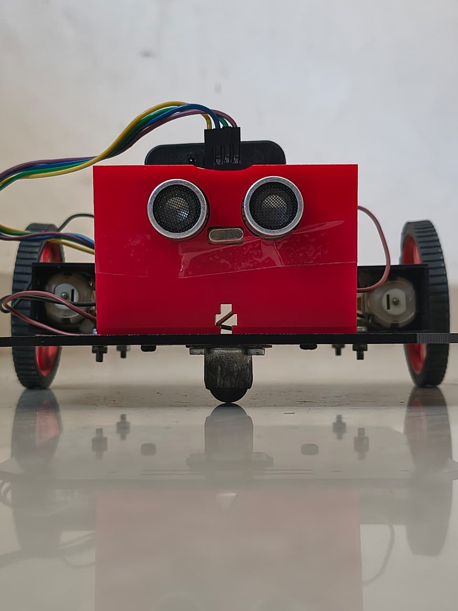
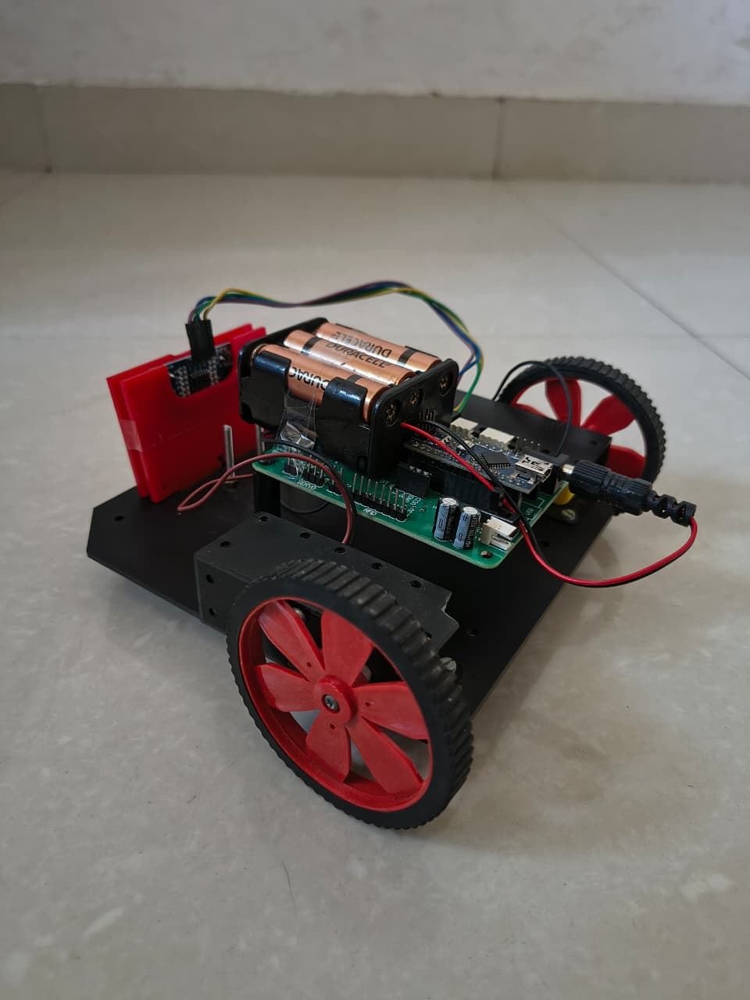
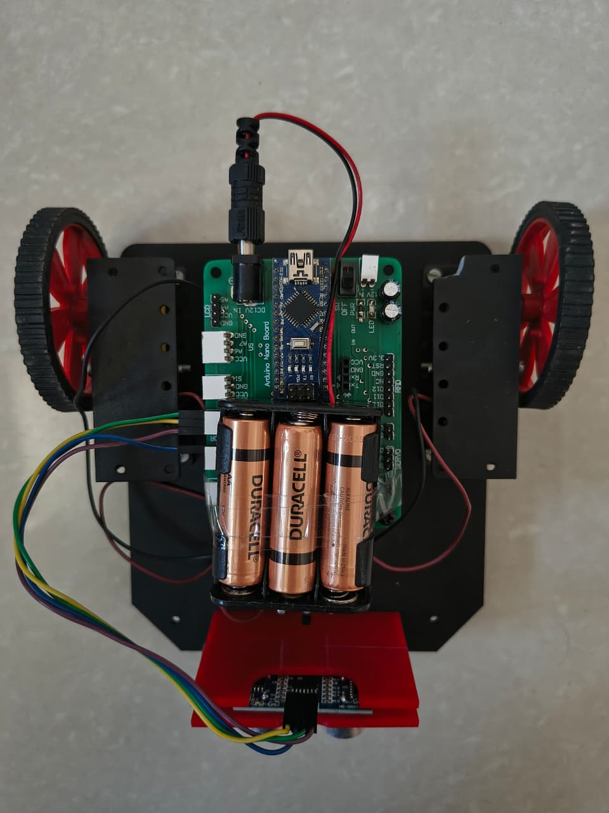

# 🤖 Obstacle Avoidance Robot

An **autonomous Arduino-based robot** designed to detect and avoid obstacles using an **ultrasonic sensor**.  
It navigates safely by measuring distance to nearby objects and changing direction when an obstacle is detected.

---

## 📸 Project Overview

| Front View | Side View |
|-------------|------------|

|  
|  
| 

---

## ⚙️ Components Used

| Component | Specification / Description |
|------------|------------------------------|
| **Arduino Nano** | Main microcontroller controlling the robot |
| **HC-SR04 Ultrasonic Sensor** | Detects obstacles and measures distance |
| **L298N Motor Driver Module** | Controls the direction and speed of DC motors |
| **DC Motors (x2)** | Provides motion to the robot |
| **Caster Wheel (x1)** | Supports robot balance and movement |
| **Robot Chassis** | Mounting platform for all components |
| **Battery Pack (4x AA)** | Provides 6V power supply |
| **Jumper Wires** | Electrical connections between components |
| **Wheels (x2)** | Allows smooth motion and turns |

---

## 🧠 Working Principle

1. The **ultrasonic sensor** continuously measures the distance to obstacles in front.  
2. If the detected object is **closer than 20 cm**, the robot stops and turns to a direction with more free space.  
3. If the path ahead is clear, it moves **forward automatically**.  

---

## ⚡ Power Supply

- **4× AA 1.5V batteries** (Total: 6V)  
- Optionally, a **7.4V Li-ion battery** can be used with regulated output for the Arduino.

---

## 🧩 Features

- Fully autonomous obstacle detection  
- Smart path selection  
- Compact and low-cost design  
- Energy-efficient movement  

---

## 🚀 Future Enhancements

- Add **Bluetooth control** for manual navigation  
- Integrate **IR sensors** for edge detection  
- Add **servo-based ultrasonic rotation** for 180° scanning  
- Implement **speed control via PWM**

---

## 🧑‍💻 Developed By

**Alok Singh Negi**  
Department of Electronics and Computer Engineering  

---

## 🪄 License

This project is open-source under the **MIT License**.
